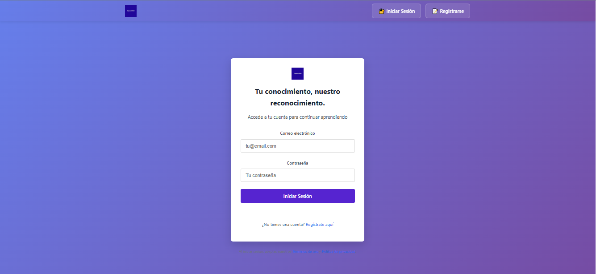
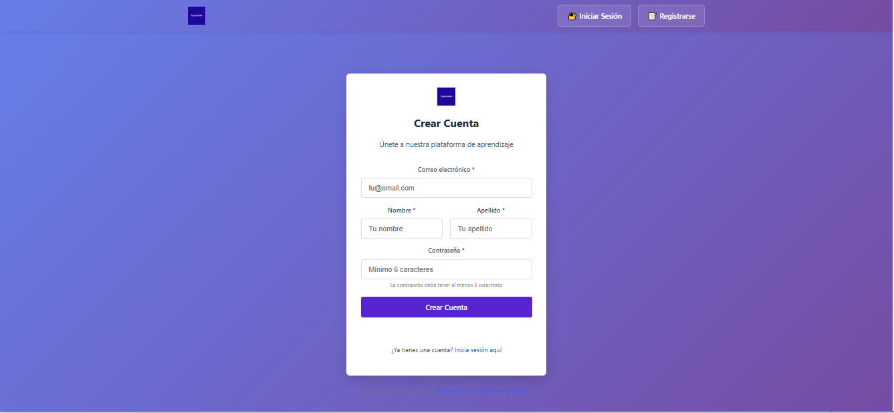
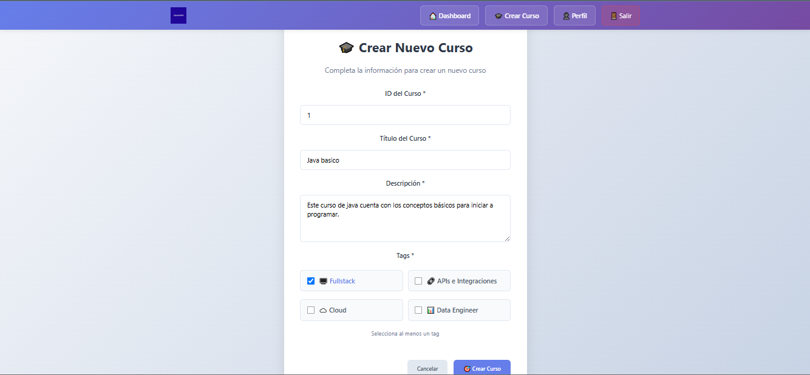
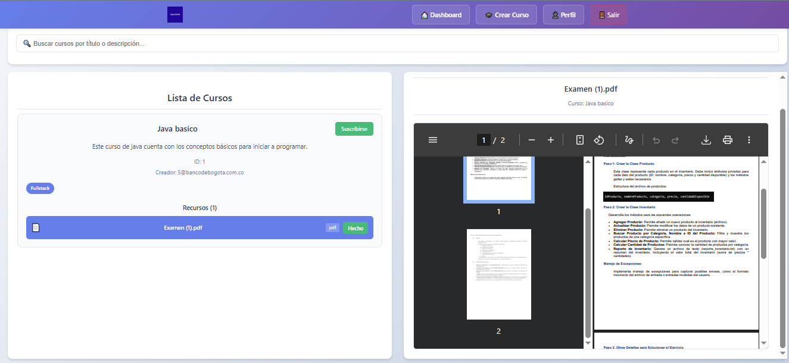
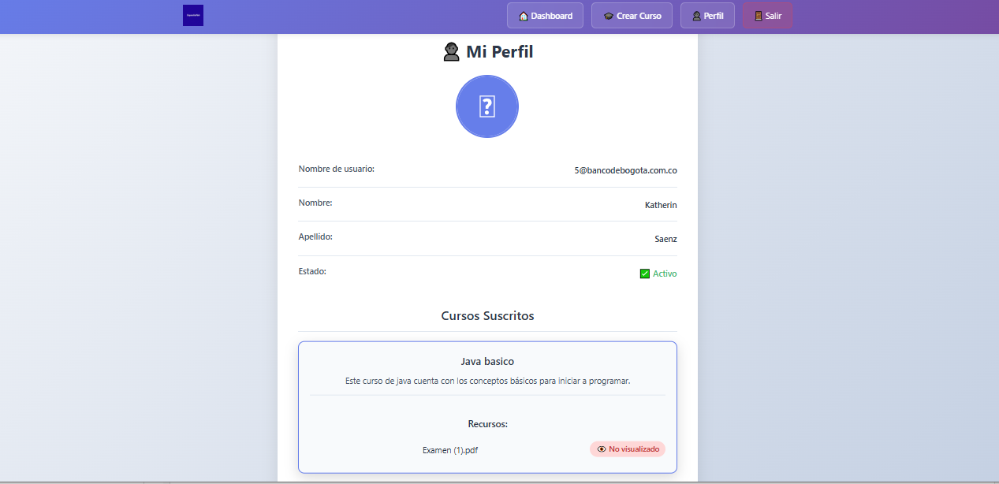
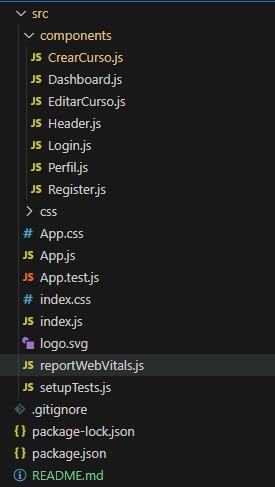

# Capacitanet - Frontend

<!-- TOC -->
* [Tabla de contenido Capacitanet - Frontend](#tabla-de-contenido-capacitanet---frontend)
  * [Descripción](#descripción)
  * [Demo](#demo)
  * [Requisitos](#requisitos)
  * [Instalación](#instalación)
  * [Ejecución](#ejecución)
  * [Configuración de conexión con Backend](#configuración-de-conexión-con-backend)
  * [Estructura del proyecto](#estructura-del-proyecto)
  * [Contribución](#contribución)
    * [Guía para contribuir al proyecto](#guía-para-contribuir-al-proyecto)
    * [Normas de codificación](#normas-de-codificación)
    * [Proceso de revisión y aceptación de cambios](#proceso-de-revisión-y-aceptación-de-cambios)
  * [Notas](#notas)
  * [Plan a Futuro / Roadmap](#plan-a-futuro--roadmap)
  * [Contacto](#contacto)
<!-- TOC -->

## Descripción
Interfaz de usuario de la plataforma **Capacitanet**, diseñada para que los colaboradores puedan:

- Iniciar sesión o registrarse.
- Acceder a cursos y módulos de capacitación.
- Visualizar su progreso.

Este proyecto está desarrollado con **React.js** y estilizado con **Javascript**, **CSS** y **HTML**.

## Demo

> Login

> Registro
  
> Crear Curso

> Lista de Cursos

> Perfil Usuario


## Requisitos

- Node.js = 22.14.0  
- npm = 11.5.2  
- Backend de Capacitanet corriendo localmente


## Instalación

Clonar el repositorio:

```bash
git clone <https://github.com/kvsaenz/capacitanetFront.git>
cd frontend
npm install
```
## Ejecución

Levantar el proyecto en modo desarrollo:

npm start


Por defecto, correrá en http://localhost:3000.

## Configuración de conexión con Backend

El frontend se comunica con el backend en los siguientes endpoints:

- Salud: http://localhost:9080/health

- Login: http://localhost:9080/capacitanet/login

- Registro: http://localhost:9080/capacitanet/registrar-usuario

- Actualizar contraseña: http://localhost:9080/actualizar-password

- Cambiar estado usuario: http://localhost:9080/capacitanet/borrar-usuario

- Crear curso: http://localhost:9080/capacitanet/crear-curso

- Suscripción curso: http://localhost:9080/capacitanet/suscribirme-curso

- Activar curso: http://localhost:9080/capacitanet/activar-curso

- Subir curso: http://localhost:9080/capacitanet/cursos/{cursoId}/recursos

- Perfil usuario: http://localhost:9080/capacitanet/perfil-usuario

- listar cursos: http://localhost:9080/capacitanet/obtener-cursos

- Cursos pendientes: http://localhost:9080/capacitanet/obtener-cursos-pendientes

- Marcar módulo: http://localhost:9080/capacitanet/ver-modulo

## Estructura del proyecto

## Contribución
### Guía para contribuir al proyecto
1. Crear una copia independiente del proyecto.
2. Crear una nueva rama para la característica o corrección de errores (`git checkout -b feature/nuevo-elemento`).
3. Realizar los cambios necesarios y hacer commit (`git commit -m 'Agrega nuevo-elemento'`).
4. Subir los cambios (`git push origin feature/nuevo-elemento`).
5. Abrir un Pull Request en el repositorio original.
### Normas de codificación
- Escribir comentarios claros y concisos.
- Mantener el código modular y reutilizable.
- Realizar pruebas unitarias para nuevas funcionalidades.
### Proceso de revisión y aceptación de cambios
- Los Pull Requests serán revisados.
- Se deben aprobar los cambios antes de ser fusionados en la rama principal.
- Se pueden solicitar cambios adicionales si es necesario.

## Notas

Este frontend depende del backend de Capacitanet. Asegúrese de tenerlo corriendo en localhost:9080 para probar.

Las imágenes y estilos pueden ajustarse según las necesidades de la empresa.

## Plan a Futuro / Roadmap

Estas son algunas funcionalidades que se planea implementar en Capacitanet:

- [ ] Sistema de insignias digitales por logros completados
- [ ] Dashboard para administradores con métricas de participación
- [ ] Notificaciones y recordatorios de cursos pendientes
- [ ] Optimización de la interfaz web para una mejor experiencia de usuario, asegurando compatibilidad que permita, en fases posteriores, su uso en móviles y otros dispositivos.


## Contacto
- Nombre: Katherin Saenz
- Email: ktherin2310@gmail.com
